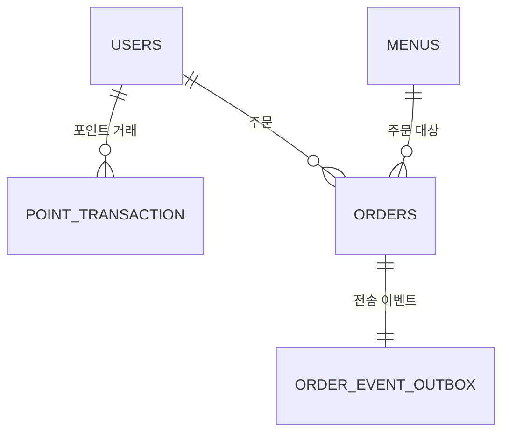

# Cafe

관리자와 회원이 사용하는 카페 서비스의 백엔드 애플리케이션입니다.
현재 범위는 회원 인증, 메뉴 조회, 포인트 충전, 메뉴 주문과 결제, 인기 메뉴 조회입니다.

## 문제 해결 전략 수립

### 설계 내용

#### ERD

DB 설계의 기준 문서는 [docs/db/ERD.md](docs/db/ERD.md)입니다.
현재 서비스는 다음 테이블을 중심으로 구성됩니다.

| 테이블 | 역할 |
|---|---|
| `users` | 회원 계정, 권한, 탈퇴 여부, 현재 포인트 잔액 저장 |
| `menus` | 메뉴 이름, 가격, 판매 상태 저장 |
| `point_transaction` | 포인트 충전과 결제 사용 이력을 원장 형태로 저장 |
| `orders` | 결제가 완료된 주문과 주문 당시 메뉴 정보를 저장 |
| `order_event_outbox` | 주문 완료 이벤트를 외부 데이터 수집 플랫폼으로 안정적으로 전송하기 위한 Outbox 저장소 |

핵심 관계는 회원이 여러 포인트 거래와 주문을 가질 수 있고, 메뉴는 여러 주문의 대상이 될 수 있으며,
주문 하나는 주문 완료 이벤트 하나와 연결되는 구조입니다.



#### API 명세서

REST API 계약의 기준 문서는 [docs/api/README.md](docs/api/README.md)입니다.
도메인별 상세 명세는 아래 문서에 나누어 정리했습니다.

| 도메인 | 문서 | 주요 API |
|---|---|---|
| 회원 인증 | [docs/api/auth.md](docs/api/auth.md) | 회원가입, 로그인, 로그아웃, 회원탈퇴 |
| 메뉴 | [docs/api/menu.md](docs/api/menu.md) | 메뉴 목록 조회, 최근 7일 인기 메뉴 조회 |
| 포인트 | [docs/api/point.md](docs/api/point.md) | 인증 회원 포인트 충전 |
| 주문 | [docs/api/order.md](docs/api/order.md) | 메뉴 주문과 포인트 결제, 주문 완료 이벤트 전송 |

공통 응답은 성공 시 `code`, `message`, `data`를 사용하고, 오류 시 `code`, `message`만 반환합니다.
API 기본 경로는 `/api/v1`이며, 금액과 포인트는 `1원 = 1P` 기준의 정수 값으로 처리합니다.

### 설계의 의도

이 서비스는 단순한 메뉴 주문 기능을 만드는 것보다, 결제와 포인트처럼 데이터 정합성이 중요한 흐름을 안전하게 처리하는 데 초점을 두었습니다.

첫째, 포인트 잔액은 `users.point_balance`에 현재값으로 저장하고, 모든 충전과 결제 내역은 `point_transaction`에 별도로 남깁니다.
현재 잔액 조회는 빠르게 처리하면서도, 나중에 문제가 생겼을 때 거래 이력을 추적할 수 있게 하기 위한 설계입니다.

둘째, 주문에는 `menu_name`, `payment_amount`를 함께 저장합니다.
메뉴 이름이나 가격이 나중에 바뀌더라도 과거 주문 내역은 주문 당시의 정보로 유지되어야 하기 때문입니다.

셋째, 회원탈퇴는 실제 행 삭제가 아니라 `is_deleted` 값을 변경하는 소프트 삭제로 처리합니다.
주문, 포인트 거래처럼 이미 발생한 이력과의 관계를 보존하면서 탈퇴 회원의 로그인과 인증만 막기 위한 선택입니다.

넷째, 주문 완료 후 외부 데이터 수집 플랫폼으로 보내야 하는 이벤트는 `order_event_outbox`에 먼저 저장합니다.
주문과 결제는 성공했는데 외부 전송만 실패하는 상황에서도 주문 데이터가 사라지지 않고, 이후 재시도 가능한 구조를 만들기 위한 의도입니다.

### 선택한 문제해결 전략 및 분석 내용

#### 1. 인증된 사용자 기준으로 기능 처리

포인트 충전과 주문은 요청 본문으로 사용자 ID를 받지 않고 JWT 인증 결과의 사용자만 사용하도록 설계했습니다.
클라이언트가 다른 사용자의 ID를 임의로 넣어 요청하는 문제를 막기 위해서입니다.

분석한 내용:

- 사용자 ID를 요청 본문에서 받으면 인증 사용자와 요청 대상 사용자가 달라질 수 있습니다.
- 포인트 충전과 주문은 본인 자산을 바꾸는 기능이므로 인증 주체를 서버에서 확정해야 합니다.
- 로그아웃 또는 탈퇴한 사용자의 토큰은 Redis 블랙리스트와 사용자 상태 검사를 통해 거부해야 합니다.

#### 2. 포인트 정합성을 위한 트랜잭션과 잠금

포인트 충전, 주문, 결제는 하나의 DB 트랜잭션 안에서 처리합니다.
특히 같은 회원에게 동시에 충전이나 결제 요청이 들어와도 잔액이 잘못 계산되지 않도록 회원 행을 비관적 쓰기 잠금으로 조회합니다.

분석한 내용:

- 잔액을 읽고 계산한 뒤 저장하는 방식은 동시 요청에서 갱신 손실이 발생할 수 있습니다.
- 주문 저장은 성공했는데 포인트 거래 저장이 실패하면 결제 이력이 불완전해집니다.
- 따라서 잔액 차감, 주문 저장, 포인트 거래 저장, Outbox 이벤트 저장은 모두 성공하거나 모두 롤백되어야 합니다.

#### 3. 인기 메뉴 집계 기준 명확화

인기 메뉴는 요청 시점 기준 직전 7일 동안 `PAID` 상태인 주문만 집계하고, 주문 수가 많은 메뉴 최대 3개를 반환합니다.
동률이면 메뉴 ID 오름차순으로 정렬해 항상 같은 결과가 나오도록 했습니다.

분석한 내용:

- "최근 7일"은 해석이 달라질 수 있으므로 `요청 시점 - 7일` 이상, `요청 시점` 미만으로 정의했습니다.
- 취소와 환불은 현재 범위에 없기 때문에 결제 완료 상태인 `PAID` 주문만 집계 대상으로 삼았습니다.
- 정렬 기준이 부족하면 같은 데이터에서도 응답 순서가 흔들릴 수 있어 동률 기준을 추가했습니다.

#### 4. 외부 전송 실패에 대비한 Outbox 전략

주문 완료 이벤트는 주문 트랜잭션 안에서 Outbox에 저장한 뒤, 커밋 이후 외부 전송을 시도합니다.
현재 구현은 mock 전송 지점으로 즉시 전송하지만, 테이블 구조는 향후 실패 재시도까지 확장할 수 있게 설계했습니다.

분석한 내용:

- 주문 DB 저장과 외부 플랫폼 전송은 서로 다른 시스템 작업이라 한 번에 완벽히 성공한다고 가정하기 어렵습니다.
- 외부 전송이 실패해도 주문과 결제 결과는 유지되어야 합니다.
- Outbox에 이벤트 원본 payload와 상태를 저장하면 실패한 이벤트를 나중에 다시 찾고 재전송할 수 있습니다.

### 기술적 선택 이유

| 기술 | 선택 이유 |
|---|---|
| Java 21 | 최신 LTS 기반으로 안정적인 백엔드 개발 환경을 구성하기 위해 선택했습니다. |
| Spring Boot | REST API, Validation, JPA, 테스트 환경을 빠르게 구성하고 일관된 애플리케이션 구조를 만들기 위해 선택했습니다. |
| Spring MVC | 요구사항이 HTTP 기반 REST API 중심이므로 가장 단순하고 익숙한 웹 계층 구성을 위해 사용했습니다. |
| Bean Validation | 요청 DTO의 필수값, 길이, 범위 검증을 컨트롤러 진입 지점에서 일관되게 처리하기 위해 사용했습니다. |
| Spring Data JPA | 도메인 엔티티 중심으로 CRUD와 트랜잭션 처리를 구현하기 위해 사용했습니다. |
| QueryDSL | 인기 메뉴 집계처럼 조건, 정렬, 그룹화가 필요한 쿼리를 타입 안전하게 작성하기 위해 선택했습니다. |
| Flyway | DB 구조를 코드와 함께 버전 관리하고, PostgreSQL 환경에서도 같은 스키마를 재현하기 위해 사용했습니다. |
| H2 | 로컬 개발과 자동 테스트를 빠르게 실행하기 위한 기본 인메모리 DB로 사용했습니다. |
| PostgreSQL | 운영 목표 DB로, 관계형 데이터와 트랜잭션 정합성이 중요한 주문·포인트 도메인에 적합하다고 판단했습니다. |
| Redis | 로그아웃된 JWT를 남은 만료 시간 동안 블랙리스트로 관리하기 위해 TTL 기반 저장소로 선택했습니다. |
| JWT | 서버가 세션을 직접 보관하지 않고 인증 정보를 검증할 수 있어 REST API 인증 방식에 적합하다고 판단했습니다. |
| BCrypt | 비밀번호를 평문으로 저장하지 않고 단방향 해시로 보호하기 위해 사용했습니다. |
| Docker Compose | 로컬에서 PostgreSQL과 Redis를 쉽게 실행하고 개발 환경 차이를 줄이기 위해 사용했습니다. |

## 실행과 검증

주요 명령은 [docs/project-profile.md](docs/project-profile.md)에 정리되어 있습니다.

```bash
./gradlew test
./gradlew build
./gradlew bootRun
```

기본 개발 DB는 인메모리 H2입니다.
PostgreSQL과 Redis는 `docker-compose.yml`로 로컬 실행할 수 있으며, 실제 비밀 값은 Git에 포함하지 않는 `.env`로 관리합니다.
